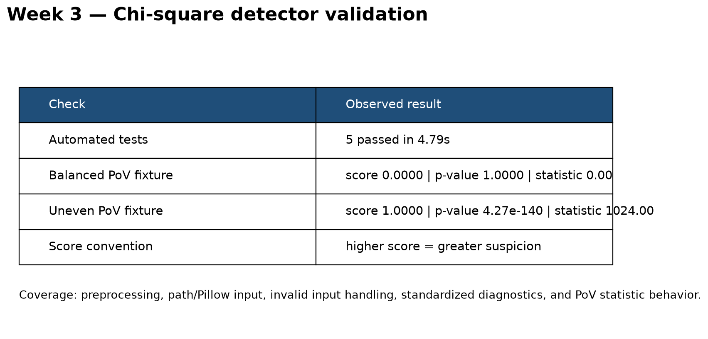

# Week 3 Progress Report — Multi-Feature Steganalysis Toolkit

**Team:** Capstone Project Team 4  
**Week:** Week 3  
**Members:** Afriyie Menishen (Team Leader), Arthur Coleman (Member A), Exzavier Pickering (Member B)

## 1. Milestones achieved

The team completed the Week 3 milestones from `project-plan.md`:

- A common detector result contract was created. Every detector now returns a score in `[0, 1]` and a named diagnostics dictionary. Higher scores mean greater suspicion.
- Shared image preprocessing was implemented. File paths, Pillow images, grayscale arrays, and RGB/RGBA arrays are converted into a validated 2-D `uint8` grayscale image.
- A Chi-square PoV detector prototype was implemented. It computes the pair-of-values histogram, chi-square statistic, degrees of freedom, p-value, and normalized suspicion score defined as `1 - p_value`.

## 2. Subtasks completed

### Common detector interface and preprocessing

`src/detectors/base.py` defines the `DetectorResult` dataclass and `load_grayscale` function. The interface validates score bounds and makes diagnostics available for future ensemble integration. Preprocessing supports path and Pillow inputs, 2-D grayscale arrays, and 3-D RGB/RGBA arrays. Invalid dimensions, nonnumeric values, nonfinite values, and pixel values outside `0..255` produce clear `ValueError` messages.

### Chi-square PoV detector

`src/detectors/chi_square.py` counts pixel values from 0 through 255 and groups them into the 128 pairs `(0,1)`, `(2,3)`, ..., `(254,255)`. For every nonempty pair, both values are compared with the pair's average expected count. The detector calculates the chi-square survival-function p-value with SciPy and returns the explainable normalized score `1 - p_value`.

## 3. Tests and demo evidence

Automated tests are stored in `tests/test_detectors.py` and cover:

1. Matching grayscale and RGB input shapes.
2. Pillow image and PNG-path loading.
3. Clear failures for invalid array dimensions and images that are too small.
4. Standardized score and diagnostic output.
5. A balanced PoV case with statistic `0`, p-value `1`, and suspicion score `0`.

The test suite completed successfully with **5 passed**. The test run and detector output are recorded in `docs/evidence/week-3-test-results.txt`, with a visual summary in `docs/evidence/week-3-test-evidence.png`.

## 4. Lessons learned

- A shared input/output contract should be established before implementing the remaining detectors so that Chi-square, RS, and DH results can be integrated without adapter code.
- Score direction must be explicit. Defining suspicion as `1 - p_value` ensures that larger values mean greater suspicion, as required by the project plan.
- Image mode and input validation are part of the detector design, not only interface polish. Converting all supported inputs to grayscale makes later comparisons reproducible.
- A balanced synthetic PoV case is useful as a deterministic unit-test oracle because its chi-square statistic and p-value have known values.

## 5. Individual contributions

| Member | Contribution this week |
| --- | --- |
| Afriyie Menishen, Team Leader | Confirmed W3 scope, reviewed the shared API design, coordinated integration, and reviewed test/documentation requirements. |
| Arthur Coleman, Member A | Contributed the Chi-square PoV design, statistic and p-value requirements, and detector test cases. |
| Exzavier Pickering, Member B | Implemented the shared preprocessing/result contract, ran the validation tests, and prepared this progress report and evidence. |

## 6. Schedule assessment

The team is progressing according to the approved plan. The W3 detector API, preprocessing rules, and Chi-square prototype are complete. No schedule adjustment is required. RS and DH implementations remain scheduled for Week 4, and the LSB dataset work remains scheduled for Week 5.

## 7. Week 4 handoff

- Member A will extend the shared interface with RS analysis.
- Member B will extend the shared interface with Difference Histogram analysis.
- The Team Leader will coordinate code review and confirm that all three detectors use the same input and score conventions.
