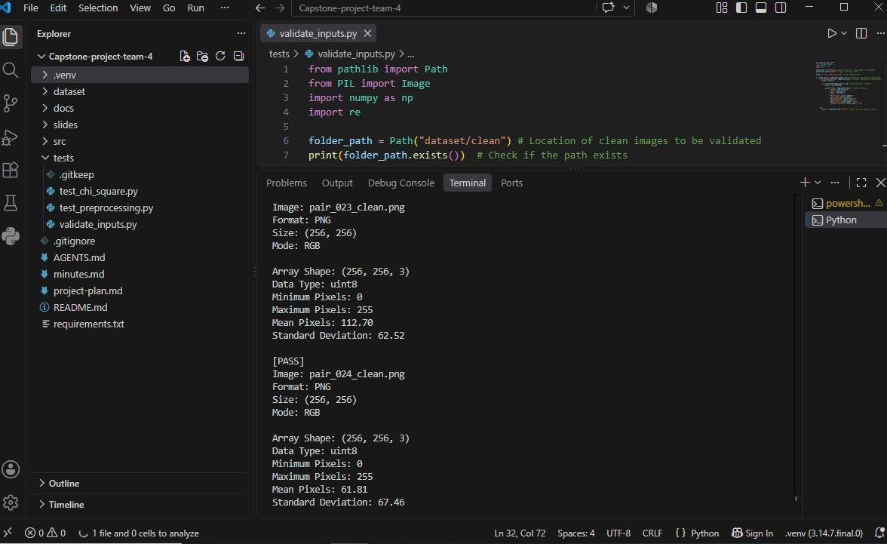
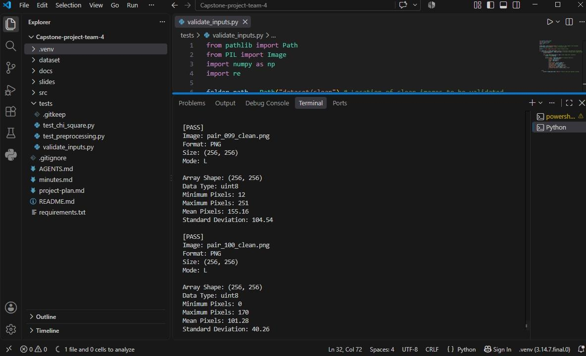
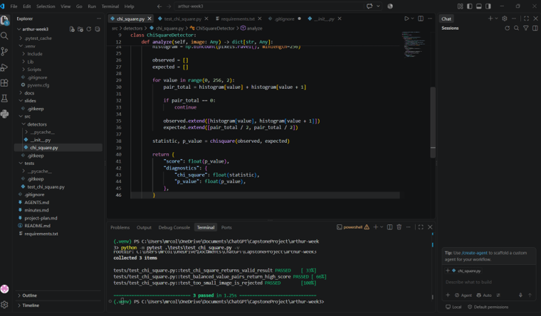

# Team 4 Week 3 Progress Report

## Multi-Feature Steganalysis Toolkit

**Team:** Afriyie Menishen, Exzavier Pickering, and Arthur Coleman  
**Reporting period:** Week 3

## 1. Milestones achieved

During Week 3, Team 4 completed the work identified in the approved project
timeline: defining a common detector interface, establishing image
preprocessing rules, and implementing the Chi-square detector prototype.

The shared `BaseDetector` interface requires future detectors to implement
`analyze(image)` and return a suspiciousness score with detector-specific
diagnostics. This gives the Chi-square, RS, and Difference Histogram detectors
a consistent output contract.

The shared preprocessing module verifies that an input image exists, loads it
with Pillow, preserves grayscale and RGB images, converts other Pillow modes to
RGB, and returns a NumPy array. It intentionally does not resize, filter, or
otherwise change pixel values before statistical analysis.

Arthur completed the initial Chi-square prototype. It analyzes pixel-value
pairs and returns a Chi-square statistic, p-value, and suspiciousness score
through the shared detector output format.

## 2. Subtasks completed

| Subtask | Owner | Completed work |
| --- | --- | --- |
| Common detector API | Afriyie Menishen | Created the `BaseDetector` interface, required `analyze(image)` method, and standard `score` and `diagnostics` result structure. |
| Image preprocessing rules | Afriyie Menishen | Added shared Pillow/NumPy image loading, supported `L` and `RGB` modes, unsupported-mode conversion, missing-file handling, unit tests, and documentation. |
| Chi-square detector prototype | Arthur Coleman | Implemented the initial Pair-of-Values detector and tests for valid output and controlled edge cases. |
| Input image preparation and validation | Exzavier Pickering | Prepared and validated clean PNG test inputs and supported preprocessing and detector testing. |

## 3. Test evidence

### 3.1 RGB image preprocessing

**Purpose:** Verify that an RGB image loads without changing its channel
structure or pixel representation.

**Expected result:** A NumPy array with RGB dimensions and `uint8` data type.

**Result:** PASS.

*Figure 1. RGB input validation output showing PNG, RGB mode, `(256, 256, 3)`
array shape, and `uint8` data type.*

### 3.2 Grayscale image preprocessing

**Purpose:** Verify that grayscale images remain grayscale rather than being
unnecessarily converted to RGB.

**Expected result:** A two-dimensional NumPy array with the expected dimensions
and `uint8` data type.

**Result:** PASS.

*Figure 2. Grayscale input validation output showing `L` mode and a
two-dimensional `(256, 256)` `uint8` array.*

### 3.3 Chi-square detector output

**Purpose:** Confirm that the Chi-square prototype returns the structure
required by the common detector interface.

**Expected result:** A score between `0.0` and `1.0` with `chi_square` and
`p_value` diagnostics.

**Result:** PASS.

*Figure 3. Arthur's Chi-square prototype and its passing pytest output.*

## 4. Lessons learned

- Defining a common detector interface before independent detector modules are
  built reduces later integration work.
- Steganalysis preprocessing must avoid resizing, filtering, and other
  pixel-changing operations because they can alter the statistics being
  measured.
- Controlled RGB, grayscale, unsupported-mode, valid-input, and invalid-input
  tests make expected behavior repeatable and verifiable.
- Focused GitHub branches, commits, and pull requests make individual team
  contributions easier to review.

## 5. Progress against the plan

The Week 3 plan required a common detector interface, image preprocessing
rules, and a Chi-square prototype. The completed API, preprocessing tests, and
Chi-square test evidence satisfy that planned milestone. No major schedule
adjustment is required at this time.

The Week 4 focus is the RS and Difference Histogram prototypes, code review,
and alignment of all detector outputs with the shared score convention.
