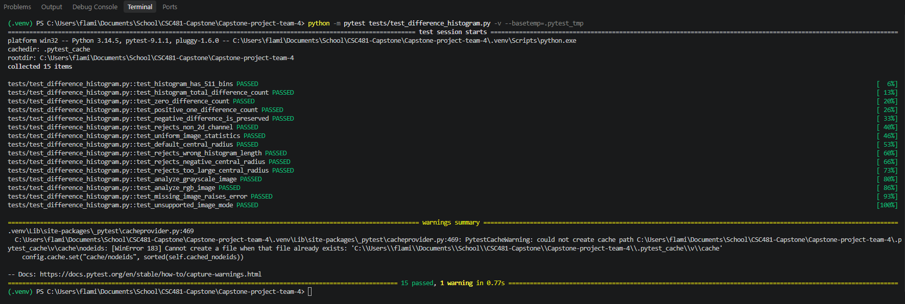
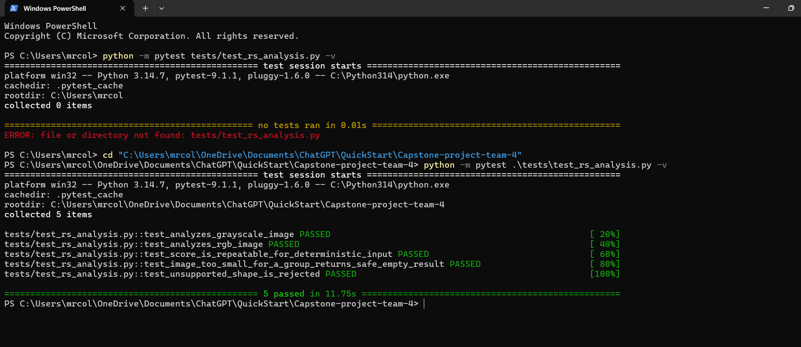
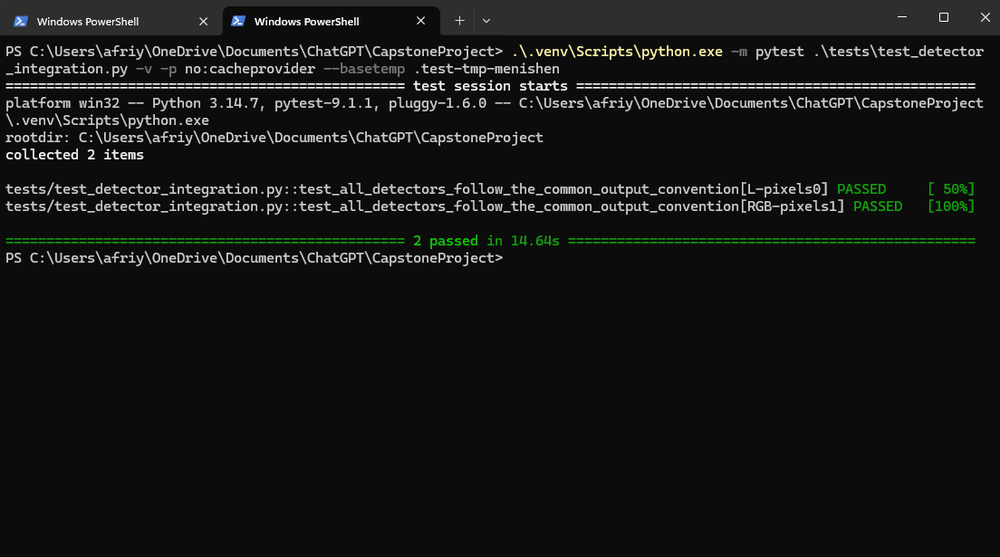

# Team 4 Week 4 Progress Report

## Multi Feature Steganalysis Toolkit

**Team:** Afriyie Menishen, Exzavier Pickering, and Arthur Coleman
**Reporting period:** Week 4

## 1. Milestones achieved

During Week 4, Team 4 completed the planned RS Analysis and Difference Histogram (DH) prototypes and verified that the project's three detectors can be used through one common output convention. The three standalone detector prototypes are now Chi square, RS Analysis, and Difference Histogram.

Arthur's RS prototype measures how an all sample LSB flip changes the local roughness of groups of four pixel samples. It returns an RS suspiciousness score and diagnostics for regular, singular, unchanged, and analyzed groups.

Exzavier's DH prototype measures horizontal and vertical adjacent pixel differences in grayscale and RGB images. It builds a 511 bin histogram for differences from -255 through +255 and records explainable roughness and zero difference diagnostics.

Menishen completed the Week 4 integration review. The shared detector convention now requires `analyze(image)` to return a numeric `score` from `0.0` through `1.0` and a `diagnostics` dictionary, where higher scores mean greater suspicion. The Difference Histogram prototype retains its raw roughness analysis and is exposed through an adapter that applies the documented bounded prototype mapping. A cross detector test confirms that all three detectors accept the shared grayscale and RGB preprocessing output without changing the input array.

## 2. Subtasks completed

| Subtask | Owner | Completed work |
| --- | --- | --- |
| RS Analysis prototype and unit tests | Arthur Coleman | Implemented a regular and singular group analysis using groups of four samples, supported grayscale and RGB inputs, returned the shared score and diagnostics structure, and added focused unit tests. |
| Difference Histogram prototype and unit tests | Exzavier Pickering | Implemented 511 bin adjacent pixel difference histograms, central histogram roughness diagnostics, grayscale and RGB analysis, validation behavior, and focused unit tests. |
| Integration and common output review | Afriyie Menishen | Reviewed all detector outputs, added the Difference Histogram shared interface adapter and exports, documented the common convention, and added a cross detector compatibility test. |
| Code review and merge coordination | Afriyie Menishen | Reviewed the RS and DH pull requests, accepted the completed contributions, and verified the merged Week 4 work against the approved project plan. |

## 3. Test evidence

### 3.1 Difference Histogram unit tests

**Purpose:** Verify the Difference Histogram calculations, diagnostics, and input validation.

**Test coverage:** The 15 tests verify the 511 bin histogram size; horizontal and vertical difference totals; zero, positive, and negative difference bins; rejection of non two dimensional channels; roughness diagnostics; invalid histogram lengths and radii; grayscale and RGB image analysis; missing images; and unsupported image modes.

**Expected result:** All Difference Histogram tests pass, showing that the prototype produces the intended histogram and handles supported and invalid inputs predictably.

**Result:** PASS - 15 tests passed.

*Figure 1. Exzavier's Difference Histogram pytest run showing 15 passing tests.*

### 3.2 RS Analysis unit tests

**Purpose:** Verify the RS prototype's detector contract and safe handling of the supported image shapes and edge cases.

**Test coverage:** The five tests verify grayscale analysis, RGB analysis, repeatable scores for deterministic input, a safe zero score when an image is too small for a four sample group, and rejection of an unsupported image shape.

**Expected result:** The RS prototype returns a bounded score and named diagnostics for supported inputs and rejects unsupported shapes clearly.

**Result:** PASS - 5 tests passed.

*Figure 2. Arthur's successful RS Analysis pytest run showing 5 passing tests.*

### 3.3 Cross detector integration test

**Purpose:** Verify that Chi square, RS Analysis, and Difference Histogram all follow the same public output convention after shared preprocessing.

**Test coverage:** The integration test runs each detector on one grayscale and one RGB image. For every detector result, it verifies the presence of `score` and `diagnostics`, a numeric score in the inclusive range `0.0` to `1.0`, a diagnostics dictionary, and that the detector did not modify the input image.

**Expected result:** All three detectors work with the same grayscale and RGB preprocessing output and return compatible result dictionaries.

**Result:** PASS - 2 tests passed.

*Figure 3. Menishen's cross detector compatibility test showing passing grayscale and RGB cases.*

## 4. Lessons learned

- Independent detector work is easier to integrate when the team agrees on input shapes, score direction, and diagnostic output names before modules are combined.
- A raw statistical feature and a common suspiciousness score have different purposes. The DH raw roughness remains available as a diagnostic, while the adapter provides a bounded prototype score for the shared interface.
- Testing grayscale and RGB inputs at the integration level catches interface differences that individual unit tests can miss.
- Terminal evidence is most useful when it states the exact test file, the completed test cases, and the final pass count.
- A fresh project setup must declare every runtime dependency. Pillow is used by the image preprocessing and integration test, so it should be added to `requirements.txt` before the next reproducibility check.

## 5. Contribution of each team member

| Team member | Week 4 contribution |
| --- | --- |
| Afriyie Menishen | Led integration, reviewed detector interfaces and score direction, added the shared DH adapter, documented the common detector output convention, added the cross detector test, reviewed pull requests, and coordinated merging. |
| Arthur Coleman | Implemented the RS Analysis prototype, its diagnostics, grayscale and RGB handling, and five unit tests. |
| Exzavier Pickering | Implemented the Difference Histogram prototype, channel level roughness diagnostics, grayscale and RGB analysis, and 15 unit tests. |

## 6. Progress against the plan

The Week 4 plan required the RS and Difference Histogram prototypes, code review, and alignment of outputs to the common score convention. The planned milestone was that three standalone modules run on sample images. This work has been achieved: the three detectors are implemented, unit tested, and verified together on grayscale and RGB sample images.

No schedule adjustment is required for the Week 4 core milestone. Before the Week 5 dataset and LSB embedding work begins, the team should add Pillow to the declared requirements so a clean environment installs every package used by the project. The Week 5 plan remains to implement the LSB embedder, gather clean images, generate paired stego images, and record dataset metadata.
