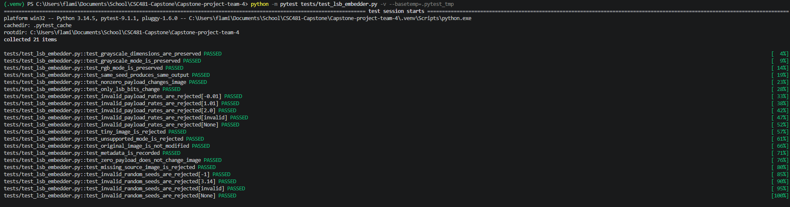
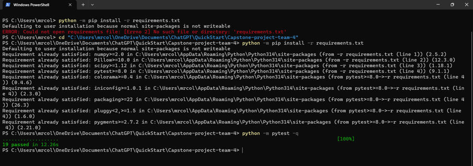
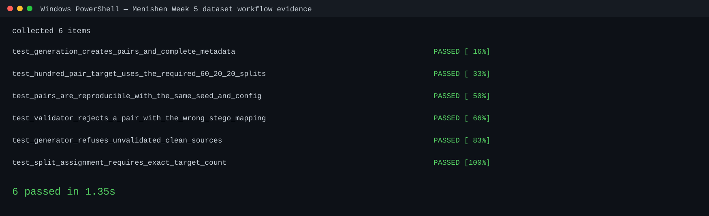

# Team 4 Week 5 Progress Report

## Multi-Feature Steganalysis Toolkit

**Team:** Afriyie Menishen, Exzavier Pickering, and Arthur Coleman  
**Reporting period:** Week 5

## 1. Milestones achieved

Week 5 established the reproducible workflow required to create the project's paired LSB-stego dataset. Exzavier completed the team's LSB embedder. Arthur completed the clean-image validation rules and prepared a collection of 100 lossless PNG files. Menishen completed the integration workflow that accepts validated clean images, calls the team LSB embedder, creates one matched stego file per clean source, writes metadata, and verifies pair integrity.

The workflow is designed for the approved project-plan split: 60 development pairs, 20 validation pairs, and 20 held-out test pairs. It records the source identifier, clean and stego filenames, payload rate, random seed, color mode, dimensions, split, image format, source/license note, and embedding statistics.

## 2. Subtasks completed

| Subtask | Owner | Completed work |
| --- | --- | --- |
| LSB embedder and unit tests | Exzavier Pickering | Implemented a deterministic LSB replacement utility for `L` and `RGB` PNG images. It preserves dimensions and mode, changes only least-significant bits, writes a separate stego image, and returns embedding metadata. |
| Clean-image validation rules and collection preparation | Arthur Coleman | Added clean-source validation rules and prepared 100 lossless PNG files for the intended collection. The validator requires a factual source identifier and source/license note for every file before it can be used. |
| Paired dataset generation and metadata workflow | Afriyie Menishen | Implemented the generation runner, documented metadata schema, deterministic per-source seed derivation, expected clean-to-stego filename mapping, split assignment, and paired-dataset validation. |
| Integration review and reproducibility verification | All team members | Reviewed the Week 5 modules together. The workflow deliberately validates the clean inventory before invoking the embedder and validates all generated pairs before reporting success. |

## 3. Test evidence

### 3.1 LSB embedder unit tests

**Purpose:** Verify that the team-owned embedder creates readable, deterministic stego outputs without changing unsupported image properties or altering the original clean file.

**Test coverage:** The 21 tests cover grayscale and RGB dimension/mode preservation; repeatable output with the same seed; a visible change for a non-zero payload; the rule that only LSB values may change; zero-payload behavior; returned metadata; source-file preservation; missing source files; tiny and unsupported images; invalid payload rates; and invalid random seeds.

**Expected result:** Supported images produce a separate PNG stego output with valid metadata, while invalid inputs are rejected clearly.

**Result:** PASS — 21 collected tests completed successfully.

*Figure 1. Exzavier's LSB embedder pytest run showing all 21 collected cases passing.*

### 3.2 Paired-dataset generation and integrity tests

**Purpose:** Verify Menishen's integration workflow without reimplementing the LSB algorithm.

**Test coverage:** The six paired-dataset tests create controlled clean-image fixtures and verify that generation produces one stego file and a complete metadata row for each source; a 100-pair collection is assigned exactly 60/20/20 across development, validation, and held-out test splits; identical seed/configuration produces matching metadata and output bytes; an incorrect stego filename mapping is rejected; an incomplete clean inventory prevents generation; and split assignment rejects an incorrect source count.

**Expected result:** The workflow only generates from a validated clean inventory and rejects malformed mappings or split configurations before they can corrupt an experiment.

**Result:** PASS — the paired-dataset tests are included in the verified 64-test repository suite shown in Figure 3.

### 3.3 Repository verification and environment setup

**Purpose:** Confirm that the project dependencies install from `requirements.txt` and that the test suite executes successfully from the repository root.

**Test coverage:** The supplied terminal evidence shows a requirements installation attempt from an incorrect directory, followed by the corrected repository path, a successful dependency check, and a successful pytest run. A fresh report-time verification then ran the current suite with cache disabled and an isolated temporary directory.

**Expected result:** Dependencies are available from the project root and the full suite completes without test failures.

**Result:** PASS — the earlier supplied run reported 19 passing tests; the current report-time run reported 64 passing tests in 7.81 seconds after the Week 5 modules were merged.

*Figure 2. Supplied terminal evidence showing the corrected repository directory, dependency check, and a successful pytest run.*

*Figure 3. Menishen's current paired-dataset pytest evidence. All six generation, pairing, split-allocation, reproducibility, and invalid-inventory cases passed.*

## 4. Lessons learned

- Dataset creation is not only an image-generation task: provenance and license records are required inputs for reproducible and legally usable research data.
- A generator should fail before writing outputs when the clean collection is incomplete. This is safer than generating files and attempting to repair provenance later.
- Pairing and split checks must be automated because a clean image and its derived stego counterpart must never be placed in different splits.
- Deterministic seeds make the generated images and metadata reproducible, which will be necessary when detector scores are compared in later weeks.
- Terminal evidence must be interpreted in context. A successful older test run remains useful setup evidence, but the report identifies the current 64-test result separately rather than presenting the older 19-test count as current.

## 5. Contribution of each team member

| Team member | Week 5 contribution |
| --- | --- |
| Afriyie Menishen | Implemented the paired dataset-generation runner, metadata schema, reproducible seed and split logic, pair-integrity validator, dataset protocol documentation, and focused generation tests. Coordinated integration review and verified the current test suite. |
| Arthur Coleman | Implemented the clean-image validator and source rules and prepared the 100 clean PNG files. The remaining task is to enter one factual source identifier and license note for each image; this work is not represented as complete. |
| Exzavier Pickering | Implemented and tested the LSB embedder, including image preservation, deterministic embedding, metadata return values, and invalid-input handling. |

## 6. Progress against the plan and adjustment

The Week 5 plan called for an LSB embedder, clean images, paired stego images, and metadata, with a target of 100 clean plus 100 stego images. The embedder, clean-image validation rules, and reproducible pair-generation/metadata workflow are complete. The repository contains the 100 clean PNG files, but the 100-pair dataset target has **not** been reached because the source/license inventory is incomplete. The repository currently contains one stego sample and an empty paired-metadata schema rather than a completed dataset.

The plan is adjusted narrowly, not abandoned: at the September 22 and September 24 Week 6 meetings, Arthur will complete the factual clean-image inventory; then the team will validate the inventory, run the established generator once to create the 100 matched pairs and metadata, and validate the 60/20/20 allocation. The team will then begin the planned Week 6 work: add per-detector diagnostic output and run preliminary scores on the development split. No detector calibration or held-out-test analysis will begin until the validated paired dataset exists.
