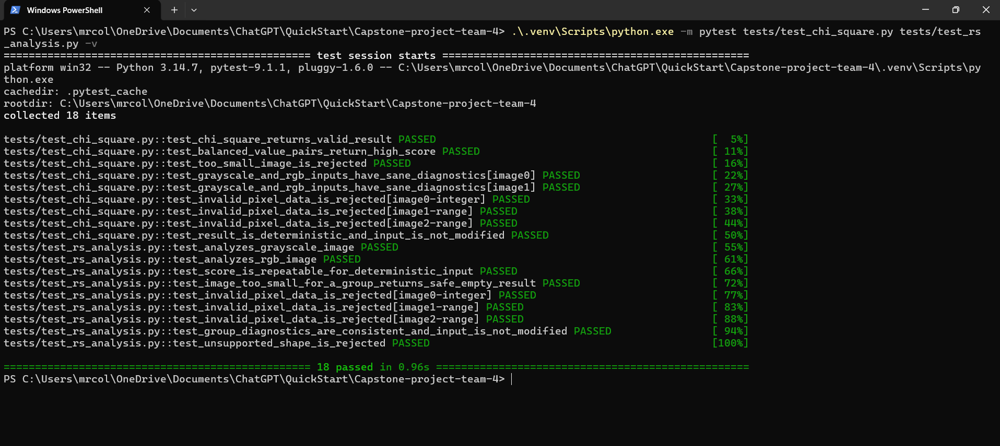
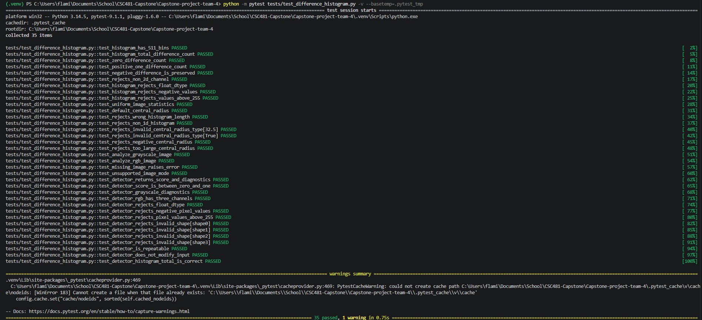
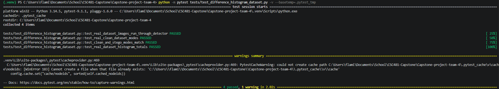

# Team 4 Week 6 Progress Report

## Multi-Feature Steganalysis Toolkit

**Team:** Afriyie Menishen, Arthur Coleman, and Exzavier Pickering
**Reporting period:** Week 6

## 1. Milestones achieved

The Week 6 plan required expanded unit tests, useful per-detector diagnostics,
and preliminary scoring over the development set. The planned evidence was a
detector score table and a defect list. Both were achieved.

The team strengthened the three non-machine-learning detector prototypes
without calibrating or combining them. The integrated development experiment
processed the planned 60 clean images and 60 matched LSB-stego images. It
produced 120 complete score records using the Chi-square, RS, and Difference
Histogram detectors. The run used only `split=development`; it did not read
the validation or held-out-test subsets.

The resulting artifacts are
[`data/development_detector_scores.csv`](../data/development_detector_scores.csv),
[`docs/week6-development-score-summary.md`](week6-development-score-summary.md),
and [`docs/week6-defect-list.md`](week6-defect-list.md).

## 2. Subtasks completed

| Subtask | Owner | Completed work |
| --- | --- | --- |
| Chi-square and RS diagnostic expansion | Arthur Coleman | Added diagnostic fields, documented their meanings, and strengthened tests for grayscale/RGB input, invalid pixel data, deterministic output, score bounds, diagnostic consistency, and input preservation. |
| Difference Histogram diagnostic and dataset testing | Exzavier Pickering | Expanded shared-API tests for score/diagnostic structure, grayscale and RGB channel diagnostics, invalid inputs, repeatability, and input preservation. Added real-dataset checks for 100 clean and 100 stego images, matching image modes, and expected histogram totals. |
| Development-set experiment, score table, and defect list | Afriyie Menishen | Implemented a reproducible runner that selects only development metadata rows, calls all three detectors for each clean/stego pair, records scores and diagnostics, writes a 120-row CSV, continues after individual processing errors, and reports a concise run summary. Created the score summary and defect list. |

### 2.1 Arthur — Chi-square and RS tests

Arthur's Week 6 tests verify the shared detector contract and detailed
diagnostics. Chi-square coverage includes grayscale/RGB inputs, too-small
input rejection, invalid dtype/range rejection, diagnostic type/value checks,
determinism, and non-mutation of the supplied image. RS coverage includes the
same valid and invalid input categories, safe behavior for undersized images,
and the internal consistency rule that regular, singular, and unchanged groups
sum to `groups_analyzed`.

**Result:** PASS — 18 Chi-square and RS tests completed in the supplied
terminal evidence.

### 2.2 Exzavier — Difference Histogram tests

Exzavier's tests cover the 511-bin difference histogram, horizontal/vertical
difference counts, zero/positive/negative differences, central-region
roughness diagnostics, invalid shapes/dtypes/ranges, grayscale/RGB handling,
shared-API score bounds, repeatability, and input preservation. The test run
also verifies the actual 100-clean/100-stego dataset can be analyzed and that
clean/stego modes match.

**Result:** PASS — 35 Difference Histogram tests completed. The supplied
terminal output contains a pytest cache warning caused by the local Windows
cache path; it did not affect the test result.

The supplied dataset-focused run separately passed four checks: all 100 clean
and 100 stego images analyze successfully, the expected clean modes are
present, each clean/stego pair has matching modes, and channel histogram totals
are correct.

### 2.3 Menishen — development-set scoring, score table, and defect list

Menishen's focused tests verify that only development rows are selected,
validation and held-out rows are excluded, all three detectors are called,
each row includes all scores and diagnostic JSON, score values are bounded,
and image or individual-detector failures are recorded without ending the
remaining run. The full project suite subsequently passed **105 tests**.

The actual preliminary run scored 60 clean and 60 stego development images.
All 120 rows completed, with zero Chi-square, RS, or DH errors. The score
summary reports descriptive means, medians, and ranges only; it makes no
threshold, ranking, or calibration decision. The defect list records no
execution defects and tracks score calibration as a planned Week 7 limitation.

## 3. Lessons learned

- Per-detector diagnostics make a bounded score interpretable and allow the
  team to distinguish data/input problems from detector behavior.
- Development, validation, and held-out data must remain isolated in code, not
  only in documentation. Filtering the scoring runner by `split=development`
  prevents accidental early use of reserved data.
- A complete experiment runner should record a per-image failure and continue
  with the remaining data rather than discarding all useful results.
- The three prototype score mappings are not directly comparable yet. Score
  normalization and error-case interpretation must wait for the planned Week
  7 work.

## 4. Contribution of each team member

| Team member | Week 6 contribution |
| --- | --- |
| Afriyie Menishen | Implemented the development-only scoring runner, runner tests, 120-row detector score table, descriptive summary, defect list, and integration verification. |
| Arthur Coleman | Expanded Chi-square and RS diagnostics, documentation, and unit-test coverage. |
| Exzavier Pickering | Expanded Difference Histogram diagnostics and unit-test coverage, including real-dataset validation checks. |

## 5. Progress against the plan and adjustment

The team progressed as planned. Week 6 required unit-test and diagnostic
expansion plus preliminary development-set scores; the detector score table
and defect list are complete. No schedule adjustment is needed.

The team intentionally did **not** normalize scores, choose detector
thresholds, inspect false-positive/false-negative cases, calibrate ensemble
weights, or use validation/held-out data. Those activities remain scheduled
for Week 7 and later under the approved project plan.
