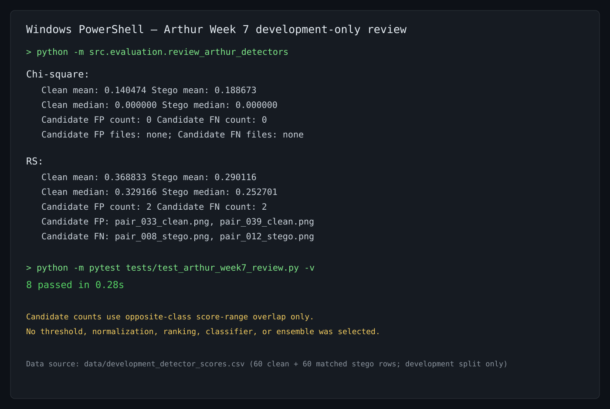

# Week 7 Arthur Review: Chi-square and RS Development Scores

## Scope

Arthur reviewed only the existing Week 6 development-score file:
`data/development_detector_scores.csv`. The file has 120 complete rows: 60
clean images and 60 matched LSB-stego images. Validation and held-out-test
results were not read, and this work does not change either detector.

## Descriptive results

| Detector | Clean mean | Stego mean | Clean median | Stego median | Candidate FP count | Candidate FN count |
| --- | ---: | ---: | ---: | ---: | ---: | ---: |
| Chi-square | 0.140474 | 0.188673 | 0.000000 | 0.000000 | 0 | 0 |
| RS | 0.368833 | 0.290116 | 0.329166 | 0.252701 | 2 | 2 |

No detector is ranked by this table. No decision threshold, score
normalization, classifier, ensemble, grid search, ROC/AUC calculation, or
final metric is selected in this review.

## Candidate-case review

Because no threshold has been selected, the counts below are not final
false-positive or false-negative classifications. For a detector whose higher
score means greater suspicion, this review flags:

- a **candidate false positive** when a clean score is greater than every
  observed stego score for that detector; and
- a **candidate false negative** when a stego score is lower than every
  observed clean score for that detector.

This is a threshold-free score-range overlap check that identifies values
outside the opposite label's observed development-score range.

| Detector | Candidate false-positive files | Candidate false-negative files |
| --- | --- | --- |
| Chi-square | None | None |
| RS | `pair_033_clean.png`, `pair_039_clean.png` | `pair_008_stego.png`, `pair_012_stego.png` |

These files are candidates for later team review; they are not evidence of a
final classifier error and do not justify changing the detector or selecting
a threshold during Week 7.

## Reproducibility and tests

Run the review from the repository root:

```powershell
python -m src.evaluation.review_arthur_detectors
python -m pytest tests/test_arthur_week7_review.py -v
```

The test file verifies that the review computes descriptive statistics and
candidate file names, rejects validation and held-out-test rows, requires both
Chi-square and RS score columns, and rejects nonnumeric, nonfinite, or
out-of-range scores. The focused run completed **8 passed**.



*Arthur Week 7 — terminal-style evidence of the reproducible development-only
review. The candidate counts are range-overlap flags, not threshold-based
classifications.*

## Arthur's Week 7 contribution

Arthur added a development-only, reproducible review for the Chi-square and
RS detectors, documented the actual descriptive results and candidate cases,
and added tests that protect the split boundary and score validation rules.
