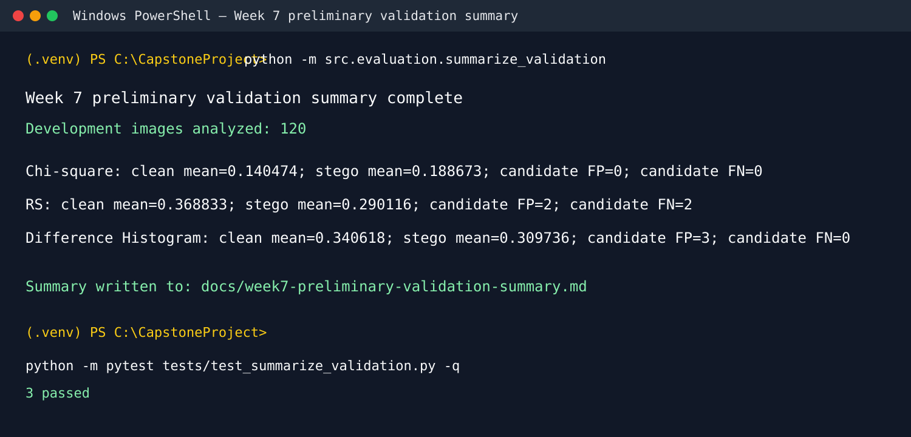

# Team 4 Week 7 Progress Report

## Multi-Feature Steganalysis Toolkit

**Team:** Afriyie Menishen, Arthur Coleman, and Exzavier Pickering
**Reporting period:** Week 7

## 1. Milestones achieved

The Week 7 plan required score-normalization review, false-positive and
false-negative inspection, preprocessing review, and a preliminary validation
summary. The team completed the planned milestone.

All analysis used the Week 6 development score table only: 60 clean and 60
matched LSB-stego images. The team retained each detector's existing bounded
`[0, 1]` prototype score for descriptive analysis rather than applying an
arbitrary rescale or choosing a threshold. The review documented that the RS
and Difference Histogram stego means were lower than their clean means in this
development run, so score direction and calibration remain later
validation-based decisions rather than Week 7 claims.

The final preliminary validation summary is in
[`docs/week7-preliminary-validation-summary.md`](week7-preliminary-validation-summary.md).

## 2. Subtasks completed

| Subtask | Owner | Completed work |
| --- | --- | --- |
| Chi-square and RS score review | Arthur Coleman | Added a development-only review of Chi-square and RS statistics, score-range candidate cases, and input validation. The review records source files for candidate cases without selecting a final threshold, ranking, classifier, or ensemble. |
| Difference Histogram score review | Exzavier Pickering | Verified the DH bounded normalization formula, compared paired clean/stego scores, inspected channel diagnostics and image modes, and documented candidate cases and preprocessing consistency. |
| Combined preliminary validation summary and preprocessing decision | Afriyie Menishen | Added a development-only summary runner, focused tests, and a Markdown decision record that combines the three detector observations, documents candidate cases with source IDs/filenames, and records the team preprocessing decision. |

### 2.1 Arthur — Chi-square and RS review tests

Arthur's review verifies descriptive statistics and candidate-file selection,
rejects validation and held-out splits, requires both detector score columns,
and rejects nonnumeric, nonfinite, and out-of-range values. The review found
no Chi-square range-extreme candidates. For RS, it identified two candidate
clean files and two candidate stego files for later review; these are not
final classification errors because no threshold was selected.

**Result:** PASS — 8 focused Arthur Week 7 review tests completed.

### 2.2 Exzavier — Difference Histogram review tests

Exzavier's tests verify development-row handling, score-normalization checks,
invalid diagnostic JSON rejection, paired source-ID matching, histogram-total
consistency, candidate false-negative reporting, and command-line formatting.
The review verified that `raw_roughness / (1 + raw_roughness)` was applied
consistently. It recorded three candidate clean range-extreme cases and no
candidate stego range-extreme cases.

**Result:** PASS — 7 focused Difference Histogram review tests completed.

### 2.3 Menishen — combined validation summary tests

Menishen's tests verify that the combined workflow excludes validation rows,
calculates detector statistics and candidate cases from development rows,
rejects invalid scores and incomplete rows, and writes all required decision
sections. The generated summary records the following descriptive results:

| Detector | Clean mean | Stego mean | Candidate FP | Candidate FN |
| --- | ---: | ---: | ---: | ---: |
| Chi-square | 0.140474 | 0.188673 | 0 | 0 |
| RS | 0.368833 | 0.290116 | 2 | 2 |
| Difference Histogram | 0.340618 | 0.309736 | 3 | 0 |

**Result:** PASS — 3 focused summary tests completed. The full repository
suite passed **123 tests** after all Week 7 review tests were made
pytest-discoverable.

## 3. Lessons learned

- A bounded score is not automatically a calibrated suspiciousness measure.
  Score direction must be checked against labeled development data before
  later calibration decisions are made.
- Reporting candidate cases by source ID and filename makes later image-level
  review reproducible without pretending that a final classifier exists.
- Development, validation, and held-out test data need explicit code-level
  separation. The Week 7 workflows used development records only.
- The review found no evidence supporting a pixel-changing preprocessing
  adjustment. Preserving native grayscale/RGB data avoids changing the
  statistical features being measured.

## 4. Contribution of each team member

| Team member | Week 7 contribution |
| --- | --- |
| Afriyie Menishen | Implemented the combined preliminary-validation summary workflow, summary tests, source/filename candidate reporting, preprocessing decision record, and integration verification. |
| Arthur Coleman | Implemented and tested the Chi-square/RS development review, descriptive statistics, and candidate range-overlap analysis. |
| Exzavier Pickering | Implemented and tested the Difference Histogram normalization/diagnostic review, paired comparison, and image-mode/preprocessing consistency analysis. |

## 5. Progress against the plan and adjustment

The team progressed as planned. Week 7 required normalization review,
false-positive/false-negative inspection, preprocessing refinement review, and
a preliminary validation summary; all are documented and tested. No schedule
adjustment is required.

The team intentionally did not select final thresholds, rank detectors, tune
ensemble weights, run ROC/AUC, use validation data for selection, or evaluate
the held-out test set. Those activities remain scheduled for later weeks in
the approved project plan.
