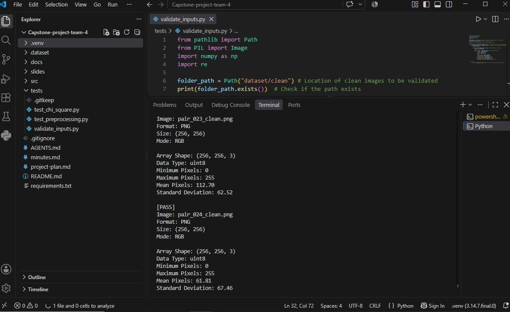
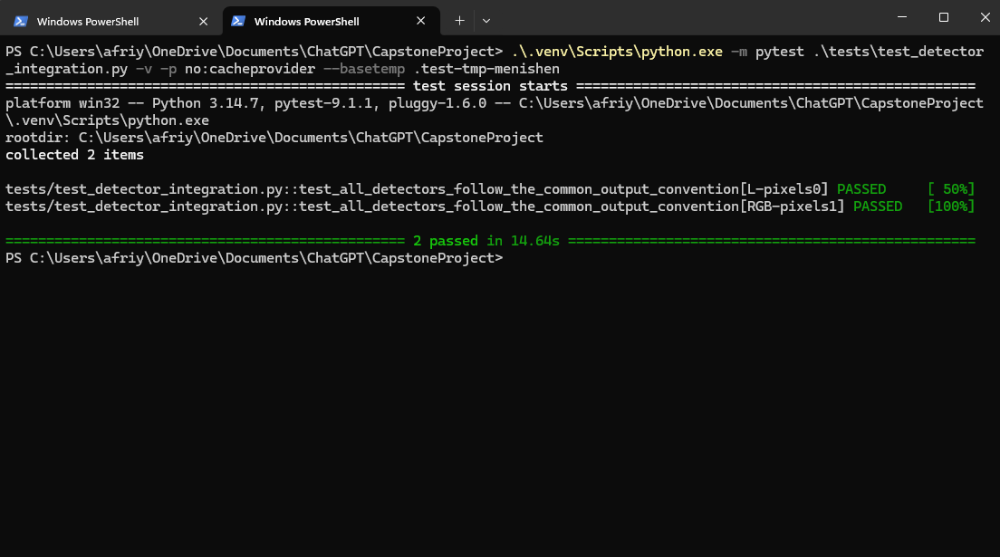
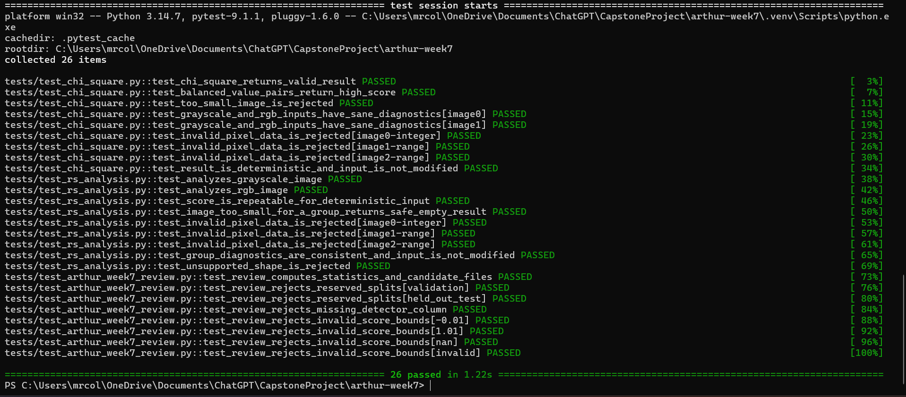
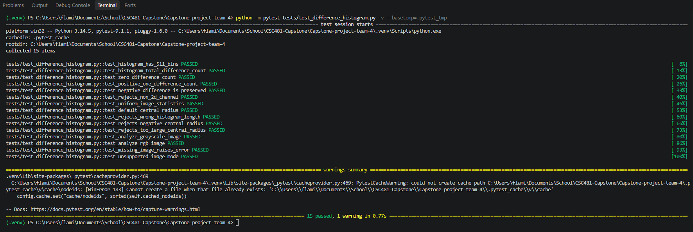
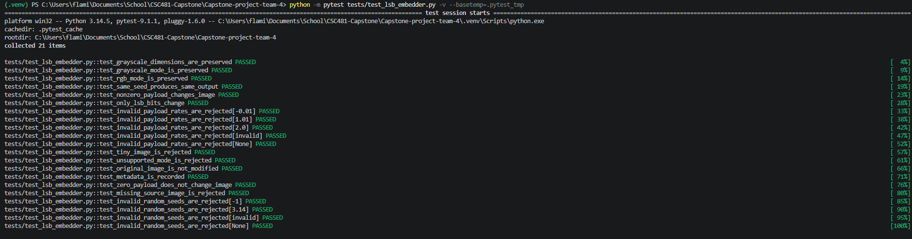
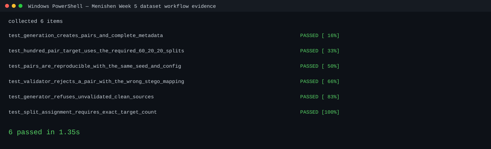
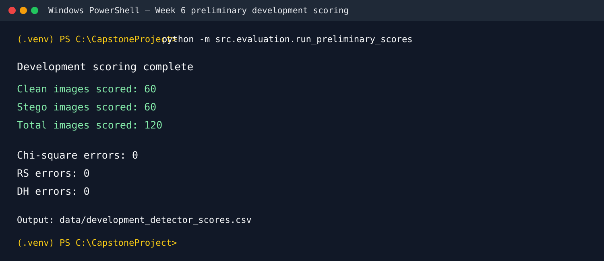
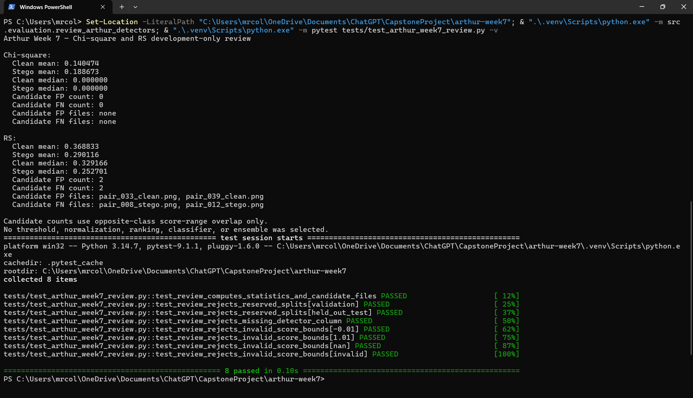
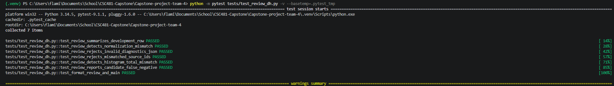
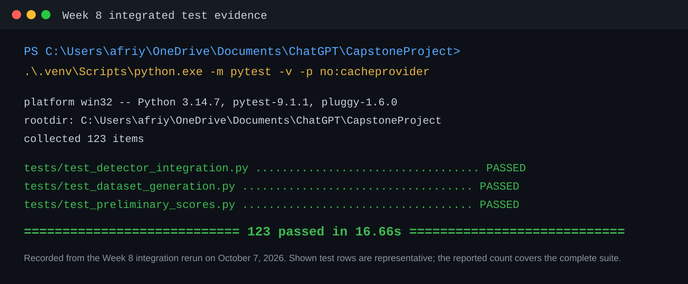

# Team 4 Cumulative Progress Report Through Week 8

## Multi-Feature Steganalysis Toolkit

**Team:** Afriyie Menishen (Team Leader), Arthur Coleman, and Exzavier Pickering  
**Reporting period:** Project start through Week 8  
**Report type:** Cumulative midterm progress report

## 1. Project purpose

Team 4 is developing an explainable, non-machine-learning image steganalysis
toolkit. The planned system will combine Chi-square, RS (regular/singular),
and Difference Histogram (DH) statistical detectors to classify images as
**Clean** or **Suspicious**. The team is also building an in-house LSB
embedder and a reproducible paired clean/stego dataset for evaluation.

This report covers completed work through the Week 8 midterm milestone. It
does not claim final classifier accuracy: ensemble weighting, threshold
calibration, ROC/AUC, held-out-test evaluation, and the final CLI remain
planned later work.

## 2. Milestones achieved

| Week | Planned milestone | Achievement and evidence |
| --- | --- | --- |
| W2 | Project scope, repository, roles, detector theory, and approved plan | The repository, team responsibilities, project plan, meeting process, and statistical-detector scope were established. The team adopted a no-machine-learning approach and a source-split safeguard for clean/stego pairs. |
| W3 | Common detector API, preprocessing rules, and Chi-square prototype | A shared `analyze(image)` contract, non-destructive image preprocessing, Chi-square prototype, documentation, and tests were completed. |
| W4 | RS and DH prototypes; common score/output review | RS and DH prototypes were implemented. All three detectors were aligned to a shared bounded score-and-diagnostics interface and tested together on grayscale and RGB arrays. |
| W5 | LSB embedder, clean images, paired stego images, and metadata | The team reached the 100 clean + 100 matching stego target. The metadata records source, license note, payload rate, seed, mode, dimensions, split, and generation details; each pair remains in the same split. |
| W6 | Detector diagnostics, unit tests, development scoring, and defect list | Per-detector diagnostics and expanded tests were added. A development-only scoring run produced 120 complete rows and the team documented the score summary and defect/limitation list. |
| W7 | Score review, candidate-case inspection, preprocessing decision | The team retained native bounded prototype scores for descriptive review, inspected score-range candidate cases, and documented the no-resize/no-filter preprocessing decision. |
| W8 | Midterm evidence package: dataset description and three working detectors | Member evidence documents, this cumulative report, the midterm report, a demo checklist, and integrated test evidence package the current prototype for demonstration. |

## 3. Completed subtasks and test evidence

### 3.1 Foundation, common interface, and preprocessing

Menishen established the common detector contract: every detector accepts a
preprocessed NumPy array and returns `{"score": float, "diagnostics": dict}`.
The score is bounded in `[0, 1]`, while diagnostics preserve the statistical
information needed to interpret it. The shared preprocessing module preserves
native `L` and `RGB` images, converts other supported Pillow modes to RGB, and
does not resize, filter, normalize, or otherwise change pixels.

Tests verify RGB and grayscale preservation, unsupported-mode conversion,
missing-file handling, the common result structure, score bounds, diagnostics,
and that all three detectors leave their input arrays unchanged.

*Figure 1. Week 3 RGB preprocessing evidence: the input remains an RGB
`uint8` NumPy array.*

*Figure 2. Week 4 integration test evidence: Chi-square, RS, and DH pass the
same output-contract checks for grayscale and RGB inputs.*

### 3.2 Chi-square and RS analysis

Arthur implemented the Chi-square pair-of-values detector and RS prototype.
Chi-square analyzes neighboring value-pair counts and reports a p-value,
Chi-square statistic, populated value-pair count, and sample count. RS
compares local roughness before and after an LSB toggle in non-overlapping
four-sample groups, returning regular, singular, unchanged, and total group
diagnostics plus the RS statistic.

Focused tests cover valid grayscale and RGB inputs, repeatability, score
bounds, diagnostic consistency, small-image behavior, invalid data types,
out-of-range pixel values, unsupported shapes, and input non-modification.
Arthur's Week 8 focused command covering Chi-square, RS, and the Week 7 review
safeguards completed with 26 passing tests; the component evidence also records
the full-suite result available at that time.

*Figure 3. Arthur's focused Week 8 test run for Chi-square, RS, and
development-review safeguards.*

### 3.3 Difference Histogram analysis

Exzavier implemented the DH prototype. It creates a 511-bin histogram of
horizontal and vertical adjacent-pixel differences from `-255` through `255`.
For the central range `-32` through `32`, it records roughness, variation,
central total, zero-difference count/fraction, histogram total, and
per-channel data. RGB channels are analyzed separately and averaged for the
image-level raw roughness. A documented bounded mapping exposes the prototype
through the shared interface.

DH tests check histogram bin count and totals, positive/negative/zero
differences, central-radius validation, grayscale and RGB handling, supported
and invalid image modes, invalid data and shapes, bounded scores, repeatable
results, input protection, and real dataset images.

*Figure 4. Early DH unit-test evidence showing correct histogram behavior and
edge-case coverage; later tests expanded this coverage.*

### 3.4 LSB embedder, paired dataset, and metadata

Exzavier implemented the team-owned LSB embedder, which preserves the original
PNG, embeds a deterministic randomized payload in a separate stego PNG, and
records generation metadata. The generator supports `L` and `RGB` inputs,
validates payload rate and non-negative integer seeds, preserves dimensions and
mode, and changes only LSB values. It includes a 32-bit payload-length header.

Menishen integrated the paired-dataset workflow. The completed dataset contains
100 clean and 100 corresponding stego PNGs. Every metadata row maps one source
identifier to a clean/stego filename pair and records payload rate, random
seed, color mode, dimensions, split, format, source/license note, and
embedding diagnostics. The split is 60 development, 20 validation, and 20
held-out-test pairs, preventing pair leakage across splits.

LSB tests verify mode and dimension preservation, deterministic output for the
same seed, nonzero and zero payload behavior, LSB-only changes, metadata,
unsupported modes, missing files, invalid rates/seeds, and processing of a
clean folder. Dataset workflow tests verify complete metadata, exact 100-pair
and 60/20/20 targets, reproducibility, invalid mapping rejection, source
inventory requirements, and split-assignment validation.

*Figure 5. Week 5 LSB embedder unit-test evidence.*

*Figure 6. Menishen's Week 5 paired-dataset generation and metadata test
evidence.*

### 3.5 Development scoring, diagnostics, and defect review

Menishen created the development-only scoring runner. It applies all three
detectors to the 60 development pairs and writes
`data/development_detector_scores.csv`. The result contains 120 rows (60
clean and 60 stego), each with Chi-square, RS, and DH scores, selected
diagnostics, serialized diagnostic records, status, and error fields. The
runner deliberately excludes validation and held-out-test rows.

The corresponding tests verify that the runner uses only development pairs,
records scores and diagnostics for every detector, records image or individual
detector failures without losing other results, and preserves required metadata
fields. The completed development run had 120 `complete` rows and zero
detector execution errors. The Week 6 defect list therefore records no observed
execution defect and tracks uncalibrated score interpretation as a planned
limitation rather than a defect.

*Figure 7. Week 6 development-set scoring evidence for the three-detector
runner.*

### 3.6 Week 7 score review and preprocessing decision

Arthur and Exzavier created development-only review evidence for their detector
areas, while Menishen integrated the preliminary validation summary. The team
kept the native bounded prototype values rather than applying an unsupported
normalization or threshold. Candidate false-positive/false-negative cases are
explicitly described as score-range review flags, not final classification
errors.

The Week 7 review found a higher stego mean for Chi-square and lower stego
means for RS and DH on this controlled development dataset. This is an
important calibration observation: no final score transformation, threshold,
detector ranking, or ensemble choice was made from these results. The review
also confirmed that no pixel-changing preprocessing adjustment was justified.

Review tests reject validation and held-out-test rows, missing score columns,
invalid score bounds, mismatched source identifiers, malformed diagnostics,
and histogram-total mismatches. They also verify descriptive summaries and
candidate-case reporting.

*Figure 8. Week 7 Chi-square/RS review tests passing on the
development-only review workflow.*

*Figure 9. Week 7 DH review tests passing.*

### 3.7 Week 8 midterm package and integrated verification

Menishen assembled the Week 8 midterm package:

- `docs/week8-midterm-report.md` — current architecture, dataset,
  detector evidence, preprocessing decision, development observations,
  limitations, and next steps;
- `docs/week8-demo-checklist.md` — a repeatable sequence to show repository
  structure, metadata, a sample run of all three detectors, development
  evidence, member evidence, and the final verification command;
- Arthur's Chi-square/RS evidence and Exzavier's DH/LSB/dataset evidence —
  focused component documentation and test proof.

The integrated rerun used the project virtual environment and completed the
full automated suite with **123 passing tests in 16.66 seconds**. This is
evidence that the current prototype components work together; it is not a
claim of final detection accuracy.

*Figure 10. Menishen's Week 8 integrated test-evidence summary showing the
full-suite command and successful result.*

## 4. Lessons learned

- Agreeing on one detector interface before combining independent modules
  reduces integration problems and makes cross-detector tests meaningful.
- Image preprocessing must not silently change pixels when the project measures
  pixel-level statistics. Preserving `L`/`RGB` inputs and avoiding resize or
  filtering protected the validity of the detector evidence.
- A bounded score is not automatically a calibrated probability. The Week 7
  observations show why score direction, transformations, and thresholds must
  be selected empirically and kept separate from held-out evaluation.
- Pair-aware metadata and source-level splits are essential. They prevent a
  clean image and its derived stego counterpart from leaking across development,
  validation, or held-out-test data.
- Deterministic seeds, recorded commands, diagnostics, and test evidence make
  the work reviewable and reproducible.
- Focused branches, pull requests, review, and automated tests made it possible
  to integrate separate team contributions while preserving individual work.

## 5. Contributions of each team member

| Team member | Completed contributions through Week 8 |
| --- | --- |
| **Afriyie Menishen — Team Leader** | Defined the shared detector interface and preprocessing rules; completed cross-detector integration; coordinated code review and project tracking; built the paired-dataset generation/metadata workflow; created development-set scoring, score-table, defect-list, and Week 7 summary workflows; assembled the Week 8 midterm report and demo checklist; maintained leader-owned meeting documentation. |
| **Arthur Coleman — Member A** | Implemented and tested the Chi-square and RS prototypes; documented their diagnostics and limitations; performed the Week 7 development-only Chi-square/RS review; packaged Week 8 detector evidence and focused test proof. |
| **Exzavier Pickering — Member B** | Implemented and tested the Difference Histogram prototype; implemented and tested the LSB embedder; supported clean/stego dataset generation and metadata verification; performed the Week 7 DH review; packaged Week 8 DH, LSB, and dataset evidence with focused test proof. |
| **All members** | Agreed on the project scope and no-machine-learning constraint, reviewed contributions through focused branches and pull requests, validated the paired-data safeguards, contributed to progress documentation, and prepared the project for the midterm demonstration. |

## 6. Progress against the approved plan

The team has completed the planned milestones through Week 8. The evidence
package now demonstrates the planned midterm state: a traceable 100-pair
dataset, three working statistical prototype detectors, a common interface,
diagnostics, automated tests, development-only score evidence, documented
limitations, and a repeatable demonstration sequence.

No schedule adjustment is required for work through Week 8. The team is not
claiming that later milestones are complete. In particular, the following work
remains intentionally scheduled:

| Planned future work | Scheduled weeks | Adjustment/decision |
| --- | --- | --- |
| Weighted-voting ensemble and equal-weight baseline | W9 | Start after the midterm package; retain the three current detector outputs as inputs. |
| Validation-based grid search for weights and threshold | W10 | Use development/validation data only; resolve score direction empirically. |
| Final held-out metrics, ROC/AUC, and confusion matrices | W11 | Keep the 20 held-out pairs reserved until this stage. |
| Payload-rate robustness and regression tests | W12 | Expand controlled conditions after calibration. |
| CLI, final documentation, report, slides, and presentation | W13–W16 | Begin only after core evaluation is complete; a CLI remains the minimum required interface. |

The main risk carried forward is that RS and DH showed lower average stego
scores on the current development run. The team will not patch this with an
arbitrary threshold. Instead, Week 9–10 work will document any transformation
and choose weights/thresholds through the planned validation workflow, keeping
the held-out test set untouched.

## 7. Evidence and supporting documents

- [Approved project plan](../project-plan.md)
- [Week 8 midterm evidence package](week8-midterm-report.md)
- [Week 8 demo checklist](week8-demo-checklist.md)
- [Arthur's Week 8 detector evidence](week8-arthur-detector-evidence.md)
- [Exzavier's Week 8 DH/LSB/dataset evidence](week8-dataset-dh-evidence.md)
- [Week 6 development score summary](week6-development-score-summary.md)
- [Week 6 defect list](week6-defect-list.md)
- [Week 7 preliminary validation summary](week7-preliminary-validation-summary.md)
