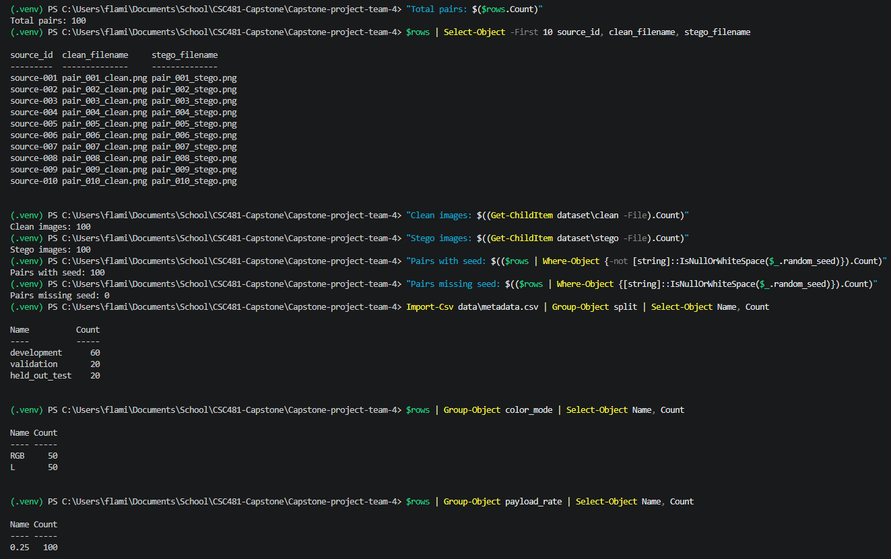
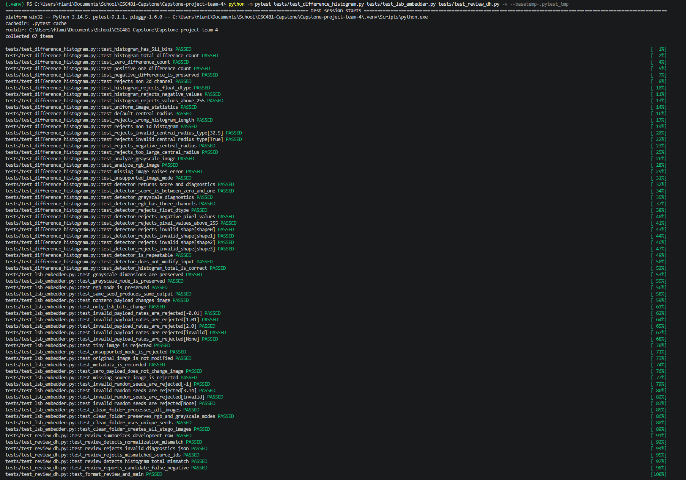

# Week 8 (Midterm) DH, LSB, and Dataset Evidence
Submission by: **Exzavier Pickering**


## Scope

This document will be the one of the midway points of where we have came to 
be in the making and completiton of this Capstone Project. I Exzavier Pickering 
will be explaining my portion of work up until this point and how it contributes 
to the overall making of this project. This should explain and verify evidence 
for the Difference Histogram (DH) detector, Least Significant Bit (LSB) embedder, 
and dataset support. It will summarize the current behavior of each function, 
reproducibility, dataset structure, relevant testing, and known limitations.

- **Disclaimer:** This work does not perform final threshold selection, 
Receiver Operating Characteristic (ROC)/Area Under the Curve (AUC) evaluation, 
ensemble weighting, or held out test analysis.


## Difference Histogram Detector

**Purpose:** Analyzes how pixel values change between neighboring pixels within 
an image to produce a statistical Difference Histogram measurement.

**Input:** Detector supports grayscale (`L`) or Luminance/Lightness images analyzed 
through one singular channel while RGB (`R`) (Red), (`G`) (Green), (`B`) (Blue) 
images are separated and analyzed through three separate channels. The pixel/channel 
values range from 0 to 255. 

**Difference Histogram:** Detector calculates the differences between horizontal 
and vertical adjacent pixel/channel values. These differences are stored in a 511-bin 
histogram ranging from `-255` to `0` to `+255`. This covers every possible difference 
between two neighboring 8-bit pixel values, where each value can range from 0 to 255. 

**Histogram Roughness:** Detector focuses on the central difference range 
`-32` to `+32` and measures the amount of change between neighboring histogram 
bins. This bin-to-bin variation is used to calculate raw histogram roughness. 

**Diagnostics:** Detector records diagnostic info including histogram variation, 
central total, zero-difference count, zero-difference fraction, histogram total, 
and channel information. The zero-difference values show how often compared pixel 
values are identical to one another.

**RGB Behavior**: For RGB images, all three channels are analyzed separately 
and their roughness values are averaged to create one raw DH roughness value 
for said image.

**Output and Score Range:** The raw DH roughness value is converted to a 
bounded score using: `raw_roughness / (1 + raw_roughness)` producing a score 
in the range of `[0, 1]`.

**Week 7 Observation:** DH clean mean came to be `0.340618` and DH stego mean 
came to be `0.309736`. In paired analysis, 59/60 stego images received lower 
DH scores than their clean counterparts. The one stego-higher pair differed by 
approx `0.000026`. The normalization formula was verified, so the score direction 
remains a later calibration issue rather than a normalization error.


## LSB Embedder

**Purpose:** Generates controlled stego pair from clean PNG (Portable Network Graphics) 
images while refraining from  altering and adjusting the original clean image. The 
stego images are later used for detector development and comparison between paired 
matching dataset.

**Input:** Embedder verifies image parameters. It supports RGB or Grayscale (`L`), 
makes sure payload rate is between set parameters of `0.0` to `1.0`, and verifies 
that the random seed must be a non-negative integer.

**Payload Rate:** Payload rate controls the fraction of the available embedding 
capacity used for an image. `0.25` represents use of approx 25% of the available 
payload capacity

**Embedding Behavior:** Embedder makes a copy of the clean image's pixel data 
and embeds randomized payload bits into randomly selected unique pixel/channel 
positions where those bits will be embedded. Only the least significant bit 
(given the name of this technique) of selected values is potentially replaced.

**Pixel Changes:** A selected pixel/channel value either remains unchanged or 
changes by one value depending on the circumstances of the pixel value. 

- Ex: A number like `72` -> `01001000` in binary can only be a number staying 
at `72` or move up `+1` to `73` -> `01001001`; vice versa, it could only move 
down `-1`.

**32-Bit Header:** A 32-bit header containing the payload length is embedded 
before the random payload data. This header records how many payload bytes are 
included in the image and reserves those 32 bits when calculating payload 
capacity making sure everything together doesn't exceed the available embedding 
capacity. 

**Reproducibility:** A deterministic random seed controls both randomized 
carrier-position selection and randomized payload generation. When processing 
the full clean folder, each image receives its own seed based on the base seed 
and its sorted position.

**Output:** After embedding, the pixel data is reshaped to the original image 
dimensions and saved as a separate PNG like pair_001_stego.png. The original 
clean image isn't overwritten.

**Metadata:** Embedder returns info including clean and stego filenames, 
payload rate, payload size, random seed, image mode, dimensions, embedding capacity, 
embedded bits, and number of pixel/channel values that actually changed.


## Dataset Evidence
The current repository dataset was checked directly before recording these results.

| Item | Verified Result |
|------|----------------:|
| Clean Images | 100 |
| Stego Images | 100 |
| Clean/Stego Pair Records | 100 |
| Development Pairs | 60 |
| Validation Pairs | 20 |
| Held-Out Test Pairs | 20 |
| RGB Pairs | 50 |
| Grayscale (`L`) Pairs | 50 |

### Pairing

Each metadata row represents one clean/stego pair connected via the same `source_id`

- Ex: `source-001` -> `pair_001_clean.png` and `pair_001_stego.png`

Because each pair is stored in one metadata row with one `split` value, the clean and stego members of the pair remain assigned to the same dataset split.


### Payload/Seed Information

- The metadata records a payload rate of `0.25` or 25% used for all 100 clean/stego pairs

- All 100 metadata pair records were checked for deterministic embedding seeds.

- All 100 contained a recorded seed, with 0 missing values.




## Testing
The test files provide evidence for the Difference Histogram 
detector, LSB embedder, and Week 7 DH development review:

**Difference Histogram Behavior:** `tests/test_difference_histogram.py` 
checks Difference Histogram construction, horizontal and vertical adjacent-pixel 
processing, RGB and grayscale handling, score bounds, diagnostics, invalid inputs, 
repeatability, and input protection.

**LSB Embedding Behavior:** `tests/test_lsb_embedder.py` checks the 
current embedding implementation, supported image inputs, payload handling, 
deterministic seed behavior, generated stego output, and other required LSB behavior.

**Week 7 DH Review Safeguards:** `tests/test_review_dh.py` checks 
development-only analysis, normalization verification, clean/stego statistics, 
RGB/Grayscale summaries, candidate cases, source pairing, histogram consistency, 
and formatted report output.


### Commands and Observed Results

*within the .venv*
```
python -m pytest tests/test_difference_histogram.py tests/test_lsb_embedder.py tests/test_review_dh.py -v --basetemp=.pytest_tmp
```



## Midterm Readiness

The Difference Histogram detector, LSB embedder, and dataset 
support are ready to be shown as working prototype components 
during the Week 8 midterm demo.

The DH detector can process RGB and grayscale image data, 
generate raw histogram roughness, produce a bounded score, 
and return diagnostic information. Week 7 development analysis 
also provides evidence of how the current statistic behaves on 
paired clean and stego images.

The LSB embedder can generate separate stego counterparts from 
clean PNG images using a controlled payload rate and deterministic 
random seeds. The current metadata records the information needed 
to trace the generation process.

The dataset currently contains 100 clean images and 100 stego 
images forming 100 clean/stego pairs. Metadata verification 
confirmed a 60 development, 20 validation, and 20 held-out-test pair 
split, with 50 RGB and 50 grayscale pairs. All 100 pair records 
contain a random seed, and all currently use a payload rate of 0.25.

These components are ready for a technical midterm demonstration, 
but they should not yet be presented as a final calibrated steganalysis 
system.

## Limitations

- The current DH score uses a prototype normalization and is 
not a calibrated probability of steganography.

- Week 7 showed that 59 of 60 paired stego images received 
lower DH scores than their clean counterparts. The score 
direction therefore still requires later calibration review.

- No final DH decision threshold has been selected.

- No final ROC/AUC evaluation or weighted ensemble evaluation 
has been performed.

- Week 7 DH observations use development data only and should 
not be treated as final accuracy results or final 
false-positive/false-negative classifications.

- Held-out test data has not been used for tuning or calibration.

- The current generated dataset uses a payload rate of 0.25 
for all 100 pairs, so the present dataset evidence does not 
yet demonstrate detector behavior across multiple payload rates.

- The current LSB component is designed for controlled randomized 
dataset generation. It is not being presented as a complete 
user-facing message-encryption or message-extraction system.
